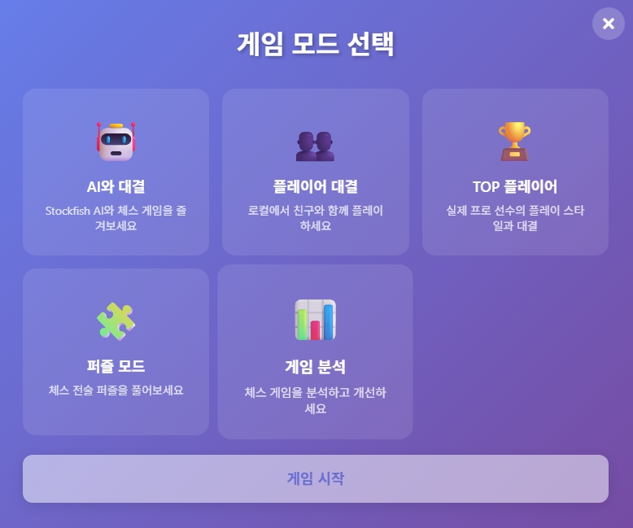
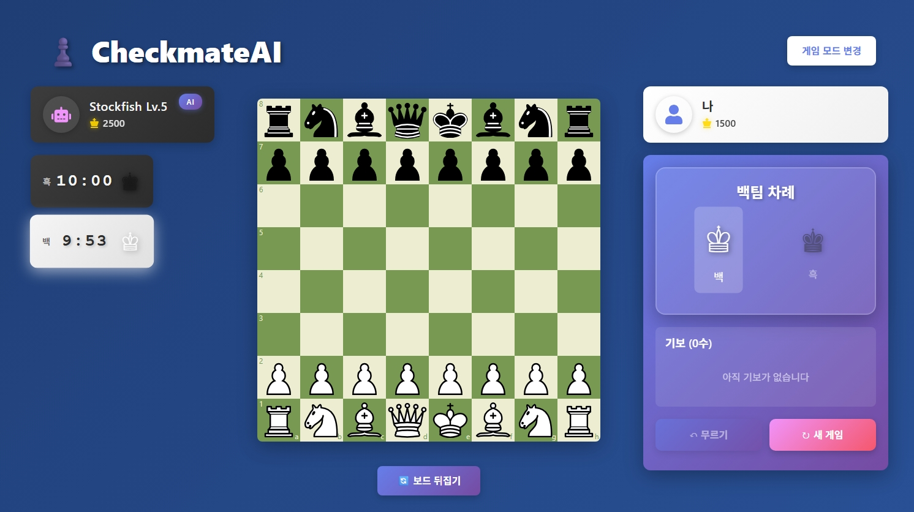
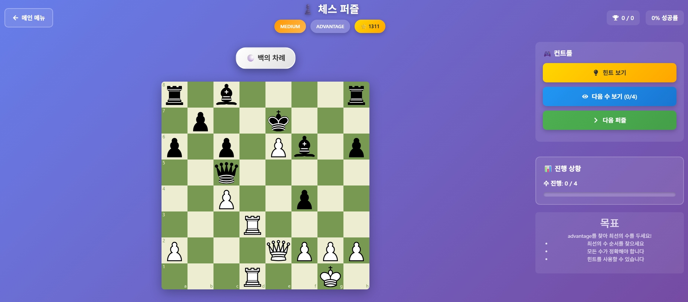

# ♟️ CheckmateAI

<div align="center">


**세계 최고의 체스 엔진 Stockfish와 함께하는 프리미엄 체스 트레이닝 플랫폼**

[🎮 빠른 시작](#-빠른-시작) • [✨ 주요 기능](#-주요-기능) • [📖 사용 가이드](#-사용-가이드) • [🛠️ 기술 스택](#️-기술-스택)

</div>

---

## 🎯 소개

**CheckmateAI**는 chess.com과 lichess.org에서 영감을 받아 제작된 **로컬 실행형 프리미엄 체스 애플리케이션**입니다. Stockfish 엔진을 활용하여 초보자부터 마스터급 플레이어까지 모든 수준의 체스 애호가를 위한 완벽한 트레이닝 환경을 제공합니다.

### 🌟 왜 CheckmateAI인가?

- ✅ **100% 무료 & 오픈소스** - 광고 없음, 프리미엄 기능 제한 없음
- ✅ **완전한 로컬 실행** - 인터넷 없이도 모든 기능 사용 가능
- ✅ **세계 최강 AI** - Stockfish 엔진 통합 (FIDE 3600+ ELO)
- ✅ **프로급 UI/UX** - 부드러운 애니메이션과 직관적인 인터페이스
- ✅ **무제한 분석** - 게임 분석, 퍼즐 풀이, AI 대전 무제한
- ✅ **맞춤형 학습** - 난이도별 AI, TOP 플레이어 스타일 학습

---

## ✨ 주요 기능

### 🎮 다양한 게임 모드

| 모드 | 설명 | 특징 |
|------|------|------|
| 👥 **플레이어 대결** | 로컬 2인 플레이 | 드래그 앤 드롭, 실시간 타이머 |
| 🤖 **AI 대결** | 20단계 난이도 조절 | 초보자부터 마스터급까지 |
| 🏆 **TOP Player** | 세계 챔피언 스타일 | 5명의 실제 선수 플레이 스타일 |
| 🧩 **퍼즐** | 실전 전술 훈련 | 516만개 퍼즐, 힌트/정답 시스템 |
| 📊 **분석** | 게임 분석 | Stockfish 엔진 평가 |

### 🎨 프리미엄 UI/UX

- **✨ 부드러운 애니메이션** - Framer Motion 60fps
- **🎭 현대적인 디자인** - 그라디언트 & 글래스모피즘
- **📱 완벽한 반응형** - 모바일/태블릿/데스크톱 최적화
- **⚡ 빠른 성능** - React 18 최적화

---

## 📸 스크린샷

<div align="center">

### 🏠 메인 화면


*5가지 게임 모드를 선택할 수 있는 메인 화면*

<br/>

### 🤖 AI 대결 모드


*Stockfish 엔진과 대결 - 20단계 난이도 조절 가능*

<br/>

### 🧩 퍼즐 모드


*516만 개 Lichess 퍼즐 - 턴 인디케이터, 힌트, 정답 보기 기능*

</div>

---

## 🚀 빠른 시작

### 필수 요구사항

- Node.js 16.0+
- Python 3.8+
- npm 또는 yarn

### 설치 및 실행

#### 1️⃣ Stockfish 엔진 설치

**Windows:**
```powershell
# PowerShell 관리자 권한 실행
Invoke-WebRequest -Uri "https://github.com/official-stockfish/Stockfish/releases/download/sf_16.1/stockfish-windows-x86-64-avx2.zip" -OutFile "stockfish.zip"
Expand-Archive -Path "stockfish.zip" -DestinationPath "server\stockfish"
```

**Mac:**
```bash
brew install stockfish
# 또는 수동 다운로드 후 server/stockfish/ 폴더에 저장
```

**Linux:**
```bash
sudo apt install stockfish
# 또는 수동 다운로드 후 server/stockfish/ 폴더에 저장
```

#### 2️⃣ 의존성 설치

```bash
# Python 패키지
pip install -r requirements.txt

# Node.js 패키지  
cd client
npm install --legacy-peer-deps
```

#### 3️⃣ Stockfish 엔진 설정

프로젝트는 세계 최강의 체스 엔진인 Stockfish를 사용합니다.

1. [Stockfish 공식 다운로드 페이지](https://stockfishchess.org/download/)에서 운영체제에 맞는 최신 버전을 다운로드합니다.

2. 다운로드한 파일을 `server/stockfish/` 폴더에 복사합니다:
   ```
   Windows: stockfish-windows-x86-64-avx2.exe
   Mac: stockfish-mac-m1
   Linux: stockfish-linux-x86-64-avx2
   ```

3. `server/ai_server.py` 파일에서 STOCKFISH_PATH를 확인하고 필요 시 수정합니다.

**참고:** Stockfish 없이도 애플리케이션은 실행되지만, AI 기능은 작동하지 않습니다.

#### 4️⃣ 서버 실행 (터미널 1)

```bash
cd server
python ai_server.py

# ✅ 서버 시작 확인:
# 🚀 CheckmateAI 서버 시작 중...
# 📍 http://localhost:5000
```

#### 5️⃣ 클라이언트 실행 (터미널 2)

```bash
cd client
npm start

# ✅ 브라우저 자동 실행:
# 🌐 http://localhost:3000
```

---

## 📁 프로젝트 구조

```
CheckmateAI/
├── client/                    # React 프론트엔드
│   ├── src/
│   │   ├── components/        # UI 컴포넌트
│   │   ├── hooks/             # Custom Hooks
│   │   ├── App.tsx            # 메인 앱
│   │   └── App.css
│   └── package.json
│
├── server/                    # Python 백엔드
│   ├── ai_server.py           # FastAPI 서버
│   └── stockfish/             # Stockfish 엔진
│
├── ai_engine/                 # AI 모듈
│   ├── stockfish_engine.py    # Stockfish 래퍼
│   ├── puzzle_generator.py    # 퍼즐 생성 (Lichess DB)
│   └── top_player_ai.py       # TOP Player AI
│
├── puzzles.db                 # 516만개 퍼즐 데이터베이스 (Git LFS)
└── README.md
```

---

## 📖 사용 가이드

### 게임 시작

1. **모드 선택** - 원하는 게임 모드 클릭
2. **설정 조정** - 난이도, 시간 등 설정
3. **게임 시작** - "게임 시작" 버튼 클릭
4. **기물 이동** - 드래그 또는 클릭으로 이동

### 키보드 단축키

| 단축키 | 기능 |
|--------|------|
| `Ctrl + Z` | 무르기 |
| `F` | 보드 뒤집기 |
| `Esc` | 모드 선택 화면 |

---

## 🛠️ 기술 스택

### Frontend
- React 18.2.0 + TypeScript
- chess.js - 게임 로직
- react-chessboard - UI
- Framer Motion - 애니메이션

### Backend  
- Python 3.8+ + FastAPI
- python-chess - 체스 라이브러리
- Stockfish 16.1 - AI 엔진

---

## 🐛 문제 해결

### Stockfish 엔진 오류
```
❌ FileNotFoundError: Stockfish 엔진을 찾을 수 없습니다
```
**해결:** Stockfish를 다운로드하여 `server/stockfish/` 폴더에 저장

### AI 응답 없음
```
❌ Connection refused: localhost:5000
```
**해결:** 서버가 실행 중인지 확인 (`python ai_server.py`)

### 패키지 충돌
```
npm error ERESOLVE unable to resolve dependency tree
```
**해결:** `npm install --legacy-peer-deps` 사용

### 퍼즐 데이터베이스 없음
```
❌ 퍼즐 데이터베이스 연결 실패
```
**해결:** `puzzles.db` 파일이 프로젝트 루트에 있는지 확인 (Git LFS로 다운로드)

---

## 🗺️ 로드맵

### ✅ 완료
- [x] 기본 체스 게임
- [x] Stockfish AI 통합
- [x] 20단계 난이도
- [x] 체스 타이머
- [x] 드래그 앤 드롭

### 🚧 진행 중
- [x] 퍼즐 DB 확장 (Lichess 516만개 퍼즐 데이터베이스)
- [x] TOP Player AI (5명의 세계 챔피언 스타일)
- [ ] 온라인 멀티플레이어

### 🔮 향후 계획
- [ ] 오프닝 북
- [ ] 레이팅 시스템
- [ ] 토너먼트 모드

---

## 🙏 감사의 말

- [Stockfish](https://stockfishchess.org/) - 오픈소스 체스 엔진
- [chess.js](https://github.com/jhlywa/chess.js) - JavaScript 체스 라이브러리
- [react-chessboard](https://github.com/Clariity/react-chessboard) - React 컴포넌트

---

<div align="center">

**즐거운 체스 게임 되세요! ♟️**

Made with ❤️ by CheckmateAI Team

</div>
